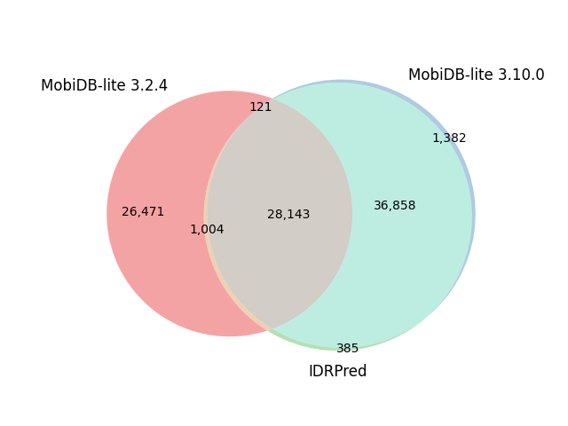
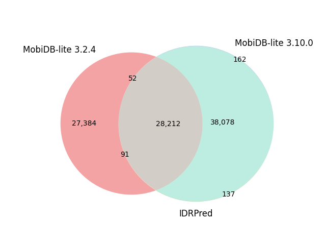
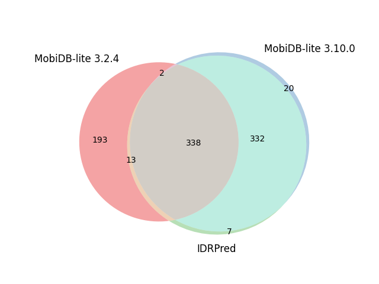
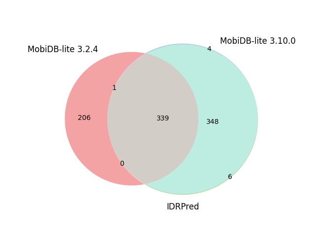
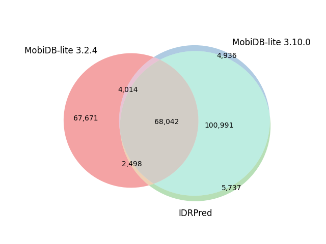
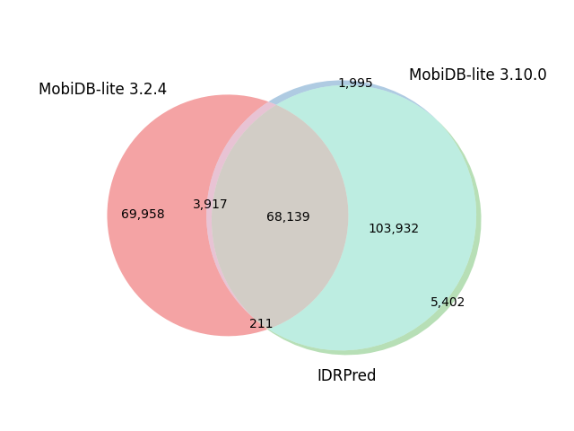
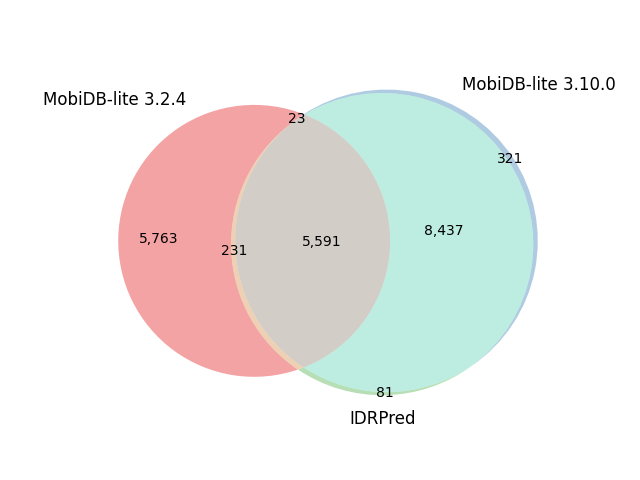

# IDRPred

IDRPred is a modern implementation of [MobiDB-lite](https://github.com/BioComputingUP/MobiDB-lite)[1], 
a method for identifying intrinsically disordered regions (IDRs) in proteins.
MobiDB-lite uses multiple predictors to derive a consensus, which is filtered 
for spurious short predictions in a second step.

The main advantage of IDRPred is that it only requires Python 3 while MobiDB-lite requires both Python 2 and 3.

## Installation

```sh
$ pip install git+https://github.com/matthiasblum/idrpred
```

## Usage

```sh
$ idrpred [options] [infile] [outfile]
```

Positional arguments:

* `infile`: The FASTA file of sequences to process. If `-` or not specified, read from standard input.
* `outfile`: The TSV file of predicted intrinsically disordered regions. If `-` or not specified, write to standard output.

### Available options

| Options          | Description                                                                                     |
|------------------|-------------------------------------------------------------------------------------------------|
| `--force`        | Derive a consensus as long as one predictor did not fail                                        |
| `--no-seg`       | Do not indentify domains of low complexity with SEG                                             |
| `--round`        | Round scores reported by individual predictors, like MobiDB-lite does                           |
| `--tempdir PATH` | Create temporary files in PATH, instead of the default temporary directory (most likely `/tmp`) |
| `--threads N`    | Process up to `N` sequences concurrently, default: `1`                                          |

## Predictors

Only predictors whose licence authorises distribution have been included in IDRPred.

| Method           | Reference |  Available  |
|------------------|----------:|:-----------:|
| ANCHOR           |       [2] |      ❌      |
| DisEMBL-465 	    |       [3] |      ✔      |
| DisEMBL-HotLoops |       [3] |      ✔      |
| DynaMine         |       [4] |      ❌      |
| ESpritz-DisProt  |       [5] |      ✔      |
| ESpritz-NMR      |       [5] |      ✔      |
| ESpritz-Xray     |       [5] |      ✔      |
| FeSS             |       [6] |      ❌      |
| GlobPlot         |       [7] |      ✔      |
| IUPred-Long      |       [8] |      ✔      |
| IUPred-Short     |       [8] |      ✔      |
| JRONN            |       [9] |      ❌      |
| Pfilt            |      [10] |      ❌      |
| SEG              |      [11] |      ✔      |
| VSL2b            |      [12] |      ❌      |

## Comparison

### Annotations

| Reference proteome | Sequences | Default options                                | IDRPred: `--round` option                            |
|--------------------|----------:|------------------------------------------------|------------------------------------------------------|
| *A. thaliana*      |    39,320 |      |      |
| *D. melanogaster*  |    26,706 |  |  |
| *E. Coli*          |     4,403 |          |          |
| *H. Sapiens*       |    82,492 |       |       |
| *S. cerevisiae*    |     6,060 |    |    |

### Performances

#### Single-threaded

Wall clock time to annotate common proteomes using one thread:

<p align="center">
    
</p>

#### Multithreaded

Wall clock time to annotate common proteomes using eight thread:

<p align="center">
    
</p>

Wall clock time to annotate one million sequences 
randomly selected from [UniParc](https://www.uniprot.org/uniparc/) 
using sixteen threads:

<p align="center">
    
</p>

## References

1. Necci M, Piovesan D, Clementel D, Dosztányi Z, Tosatto SCE. MobiDB-lite 3.0: fast consensus annotation of intrinsic disorder flavors in proteins. Bioinformatics. 2021 Apr 1;36(22-23):5533-5534. DOI: [10.1093/bioinformatics/btaa1045](https://doi.org/10.1093/bioinformatics/btaa1045). PMID: [33325498](https://europepmc.org/article/MED/33325498).
2. Dosztányi Z, Mészáros B, Simon I. ANCHOR: web server for predicting protein binding regions in disordered proteins. Bioinformatics. 2009 Oct 15;25(20):2745-6. DOI: [10.1093/bioinformatics/btp518](https://doi.org/10.1093/bioinformatics/btp518). Epub 2009 Aug 28. PMID: [19717576](https://europepmc.org/article/MED/19717576); PMCID: PMC2759549.
3. Linding R, Jensen LJ, Diella F, Bork P, Gibson TJ, Russell RB. Protein disorder prediction: implications for structural proteomics. Structure. 2003 Nov;11(11):1453-9. DOI: [10.1016/j.str.2003.10.002](https://doi.org/10.1016/j.str.2003.10.002). PMID: [14604535](https://europepmc.org/article/MED/14604535).
4. Cilia E, Pancsa R, Tompa P, Lenaerts T, Vranken WF. From protein sequence to dynamics and disorder with DynaMine. Nat Commun. 2013;4:2741. DOI: [10.1038/ncomms3741](https://doi.org/10.1038/ncomms3741). PMID: [24225580](https://europepmc.org/article/MED/24225580).
5. Walsh I, Martin AJ, Di Domenico T, Tosatto SC. ESpritz: accurate and fast prediction of protein disorder. Bioinformatics. 2012 Feb 15;28(4):503-9. DOI: [10.1093/bioinformatics/btr682](https://doi.org/10.1093/bioinformatics/btr682). Epub 2011 Dec 20. PMID: [22190692](https://europepmc.org/article/MED/22190692).
6. Piovesan D, Walsh I, Minervini G, Tosatto SCE. FELLS: fast estimator of latent local structure. Bioinformatics. 2017 Jun 15;33(12):1889-1891. DOI: [10.1093/bioinformatics/btx085](https://doi.org/10.1093/bioinformatics/btx085). PMID: [28186245](https://europepmc.org/article/MED/28186245).
7. Linding R, Russell RB, Neduva V, Gibson TJ. GlobPlot: Exploring protein sequences for globularity and disorder. Nucleic Acids Res. 2003 Jul 1;31(13):3701-8. DOI: [10.1093/nar/gkg519](https://doi.org/10.1093/nar/gkg519). PMID: [12824398](https://europepmc.org/article/MED/12824398); PMCID: PMC169197.
8. Mészáros B, Erdos G, Dosztányi Z. IUPred2A: context-dependent prediction of protein disorder as a function of redox state and protein binding. Nucleic Acids Res. 2018 Jul 2;46(W1):W329-W337. DOI: [10.1093/nar/gky384](https://doi.org/10.1093/nar/gky384). PMID: [29860432](https://europepmc.org/article/MED/29860432); PMCID: PMC6030935.
9. Yang ZR, Thomson R, McNeil P, Esnouf RM. RONN: the bio-basis function neural network technique applied to the detection of natively disordered regions in proteins. Bioinformatics. 2005 Aug 15;21(16):3369-76. DOI: [10.1093/bioinformatics/bti534](https://doi.org/10.1093/bioinformatics/bti534). Epub 2005 Jun 9. PMID: [15947016](https://europepmc.org/article/MED/15947016).
10. Jones DT, Swindells MB. Getting the most from PSI-BLAST. Trends Biochem Sci. 2002 Mar;27(3):161-4. DOI: [10.1016/s0968-0004(01)02039-4](https://doi.org/10.1016/s0968-0004(01)02039-4). PMID: [11893514](https://europepmc.org/article/MED/11893514).
11. Wootton JC. Non-globular domains in protein sequences: automated segmentation using complexity measures. Comput Chem. 1994 Sep;18(3):269-85. DOI: [10.1016/0097-8485(94)85023-2](https://doi.org/10.1016/0097-8485(94)85023-2). PMID: [7952898](https://europepmc.org/article/MED/7952898).
12. Peng K, Radivojac P, Vucetic S, Dunker AK, Obradovic Z. Length-dependent prediction of protein intrinsic disorder. BMC Bioinformatics. 2006 Apr 17;7:208. DOI: [10.1186/1471-2105-7-208](https://doi.org/10.1186/1471-2105-7-208). PMID: [16618368](https://europepmc.org/article/MED/16618368); PMCID: PMC1479845.
